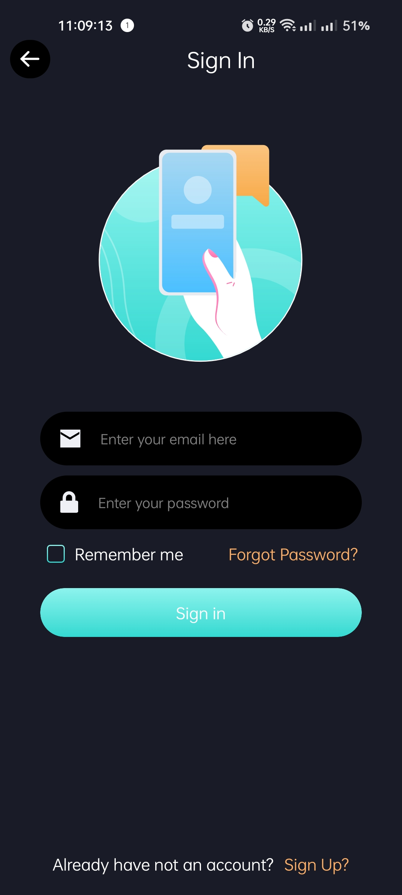
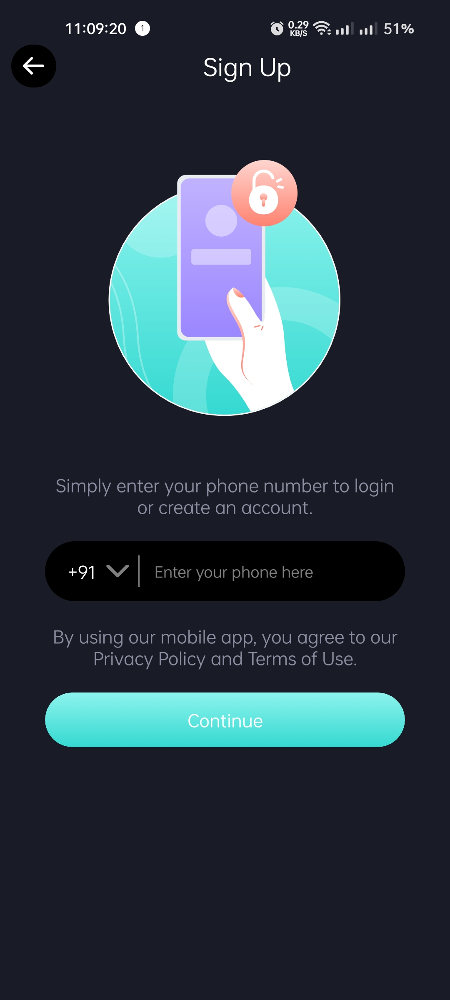
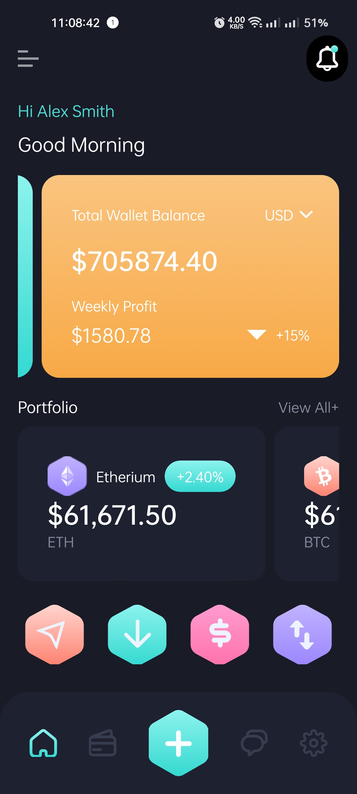
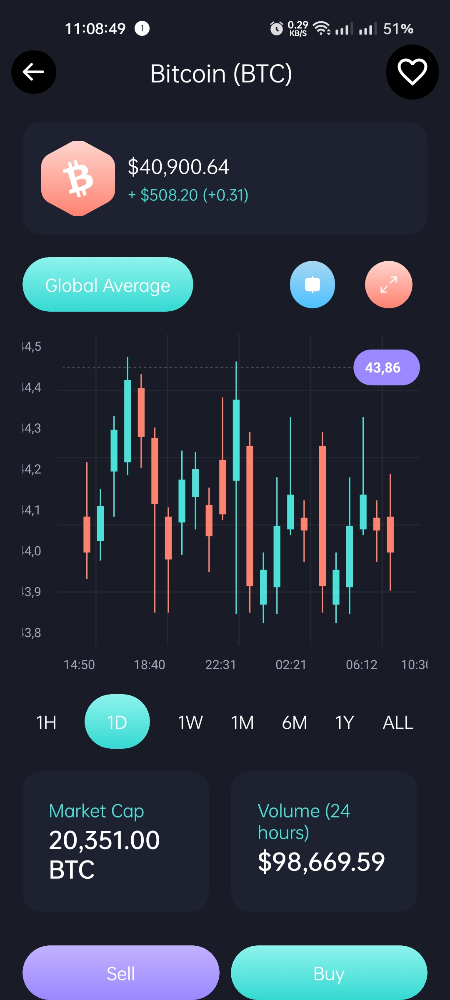
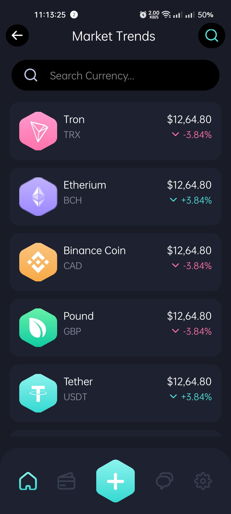
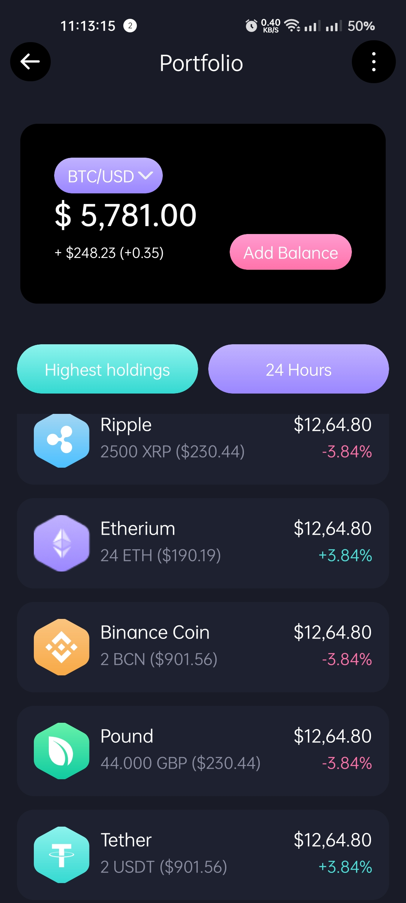
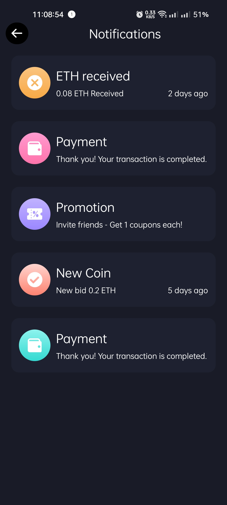
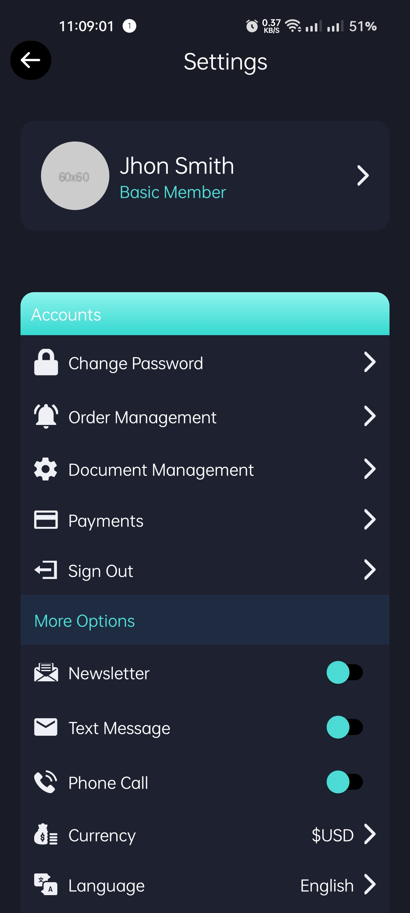

# BitEx (Bitcoin Exchange)

This assignment received during previous interview as `pre-interview assignment`.

> ### [Download APK file](https://drive.google.com/uc?export=download&id=1tcSshxq-e6I93diOn7eD85F4sxtSj28S)

## Stack used

- Expo framework
- Written in `typescript`
- expo-image library (for svg images)
- expo-linear-gradient
- react-navigation (for routing/navigating between screens)

## Screenshots

## 🚀 How to use

- Install packages with `yarn` or `npm install`.
  - If you have native iOS code run `npx pod-install`
- Run `yarn start` or `npm run start` to start the bundler.
- Open the project in a React runtime to try it:
  - iOS: [Client iOS](https://itunes.apple.com/app/apple-store/id982107779)
  - Android: [Client Android](https://play.google.com/store/apps/details?id=host.exp.exponent&referrer=blankexample)
